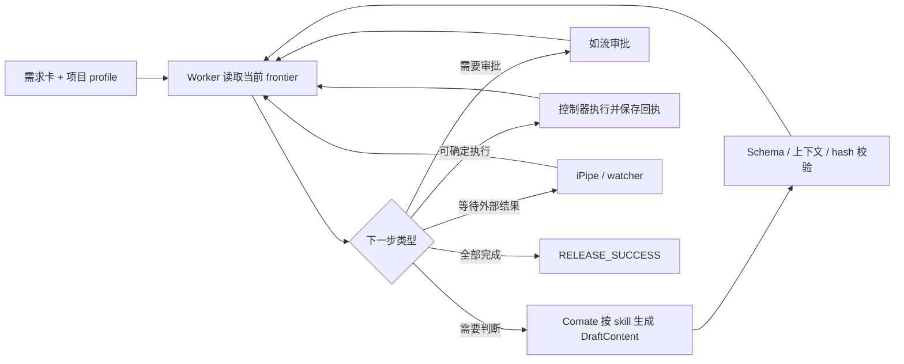

# Tom Autodev

**用一句命令启动需求，用模型完成判断，用控制器校验和推进，用人工审批关键动作。**

Tom Autodev 把一张 iCafe 需求卡推进到代码、独立产品测试、Review、iCode、iPipe 和发布确认。每个需求都有一个持久化 `run`，输入、产物、审批、锁、外部回执和恢复信息都会保存下来。

适用环境：**Comate + iCafe / iCode / iPipe / KU / 如流**。Mac 负责源码、流程控制和 Review；编译、模拟器和业务测试在配置好的 iPipe runner 执行。

## 先看这一页

### 你只需要记住 4 个动作

```bash
# 1. 创建或继续一张需求卡，并推进到下一个待办
python3 tom-autodev/scripts/cli.py process CARD PROJECT

# 2. 查看进度
python3 tom-autodev/scripts/cli.py status CARD_OR_RUN

# 3. 查看模型当前要填什么
python3 tom-autodev/scripts/cli.py context CARD_OR_RUN

# 4. 审批后继续
python3 tom-autodev/scripts/cli.py continue CARD_OR_RUN
```

模型需要提交草案时，再执行：

```bash
python3 tom-autodev/scripts/cli.py submit-draft CARD_OR_RUN JOB_ID draft.json
```

`submit-draft` 只接收当前 schema 要求的 `DraftContent`，不接收 `ArtifactEnvelope`。需要审批时，CLI 会自动发起绑定当前草案和 `approval_input_hash` 的审批；成功返回 `PARKED / APPROVAL_WAIT`，不会自动批准。

### 一张卡的完整路径

```text
确认需求和项目
  → Intake / Grill
  → Spec + 任务 DAG
  → 工作区
  → 计划
  → 业务代码 + 独立产品测试
  → Review
  → iCode 提交
  → iPipe 编译、测试、回归
  → 发布确认
```

有代码或测试问题时进入 `Diagnose`，再回到 Spec、Plan 或 Implement。iPipe 失败必须按真实平台证据处理；控制器不会把本地结果当成 iPipe 结果。

## 原理：谁做什么

| 角色 | 负责什么 | 不能做什么 |
|---|---|---|
| 人 | 确认需求和验收标准；审批设计、改动、提交、重跑和发布 | 不能用聊天内容替代绑定具体版本的审批 |
| Comate + skill | 澄清、设计、拆任务、生成代码和测试、Review、诊断 | 不能直接改状态、伪造 envelope、提交 iCode 或触发 iPipe |
| Python 控制器 + WorkerDriver | 计算下一步、校验 schema/hash/版本/前驱、保存状态、执行已批准动作 | 不猜测缺失输入，不重复外部副作用 |
| iPipe | 在固定版本和环境中编译、测试、回归并返回证据 | 不接受本地模拟结果冒充平台证据 |

模型只返回内容。WorkerDriver 负责把内容封装成产物、绑定审批、校验并推进状态。需要模型时返回 `ProducerJob`；需要人工时返回 `ApprovalJob`；需要外部结果时保存检查点并等待。



## 工作流怎么走

### 默认路径和变体

| 路径 | 用途 | 已减少的步骤 |
|---|---|---|
| `standard` | 普通需求 | Spec 和任务 DAG 合并为一次 ProducerJob |
| `express` | 已有明确验收点的缺陷或小改动 | Grill 可自动生成，部分设计审批合并 |
| `hotfix` | 紧急修复 | 计划仍生成，但独立 G4 审批可省略 |
| `full` | 大型、跨仓或高风险需求 | 保留完整 Spec、Tasks 和审批路径 |

路径由运行开始时固定，并写入 run。复杂需求可显式选择 `full`；不能在中途静默降低风险等级。

项目和语言知识按需加载：BGW 使用 `tom-lang-c-cpp` + `tom-project-bgw`，XFlow 使用 `tom-lang-npl` + `tom-project-xflow`。流程职责由 `tom-autodev`、`tom-grill`、`tom-spec`、`tom-tasks`、`tom-plan`、`tom-implement`、`tom-review` 和 `tom-diagnose` 分担；standard 路径会合并可合并的模型工作，不要求每个 skill 都单独启动一次 agent。

### 阶段职责

| 阶段 | 产物或动作 | 关键控制 |
|---|---|---|
| Intake / Grill | 需求快照、协作绑定、澄清决策和验收点 | 空验收点会阻断；原始快照不被模型改写 |
| Spec / Tasks | 行为 Spec、测试接口、环境要求、任务 DAG | 验收覆盖、依赖和任务边界可追溯 |
| Workspace | 为当前任务绑定仓库、分支、基线和工作区 | 检查脏工作区、版本和所有权 |
| Plan | 当前任务的实现计划 | 计划和工作区绑定到同一任务与版本 |
| Implement | 业务改动和独立产品测试改动 | 真实 diff、仓库 revision、Change-Id 可核验 |
| Review | 标准和 Spec 双轴 Review | 未通过或需澄清时不能提交 |
| Submit | 提交 iCode、绑定 CR/revision、准备 iPipe | G7 绑定精确版本和输入 hash |
| iPipe | 编译、单测、回归、集成和人工阶段 | 只接受冻结计划对应的真实平台证据 |
| Release | 核验所有必需模块的发布结果 | 缺模块、错版本或缺平台证明都不能成功 |
| Diagnose | 记录根因、失败证据和修复方向 | 修复预算由持久化历史计算，不能无限循环 |

## 首次使用

所有命令从仓库根目录执行。

### 1. 获取代码并安装 skill

已有工作区可跳过 clone：

```bash
git clone --branch phase1-workflowspec https://github.com/zhaotao19860/tom-autodev-suite.git
cd tom-autodev-suite

python3 -c 'import yaml; print(yaml.__version__)'

python3 tom-autodev/scripts/install_links.py \
  --root "$PWD" --destination "$HOME/.comate/skills" --dry-run
python3 tom-autodev/scripts/install_links.py \
  --root "$PWD" --destination "$HOME/.comate/skills"
```

缺少 PyYAML 时，在当前 Python 环境安装 `PyYAML`。安装脚本遇到同名目录或不同链接会报告 `CONFLICT`，不会覆盖已有内容。

### 2. 注册项目

在 Comate 中调用 `/tom-autodev`：

> 注册 BGW 项目。核对业务仓、独立产品测试仓、iPipe 环境和审批渠道，列出缺失项；确认后保存项目 profile。

需要准备：

- 业务仓、iCode 模块、目标分支、独立产品测试仓。
- 测试接口、夹具、iPipe 模板、允许参数和 runner 要求。
- 项目 skill、语言 skill、源码和可核对版本的知识文档。
- Review 方式、KU 位置、Comate/如流审批人、发布规则。

profile 保存在 `~/.tom-autodev/config/projects/<project>.yaml`。注册只保存和验证配置，不启动需求、不生成代码、不提交 iCode、不触发 iPipe。字段说明见 [项目注册说明](tom-autodev/references/setup.md) 和 [profile schema](tom-autodev/schemas/project-profile.schema.json)。

### 3. 做只读预检

```bash
python3 tom-autodev/scripts/cli.py preflight bgw
```

预检检查项目 profile、平台访问和本机自动化配置。返回结果中的 `automation` 会说明：

- Stop-hook 是否引用 `ide_turn_hook.py`。
- watcher 命令文件是否存在。
- watcher 的调度配置、运行状态、最近成功时间。

cron、launchd 或其他外部调度器没有统一心跳接口，所以 watcher 的后三项可能是 `unknown`。`preflight` 不会安装、启动或唤醒任何进程。返回 `PROJECT_NOT_READY` 时，先按 `missing` 修复配置。

### 4. 配置审批续跑和 watcher

这一步用于自动接收如流和 iPipe 结果；手动执行 `continue` 时仍可继续运行。

- 将 [ide_turn_hook.py](tom-autodev/scripts/ide_turn_hook.py) 注册到 `~/.comate/hooks.json` 或 `~/.comate/hooks.local.json` 的 `Stop` 事件。
- 运行审批 watcher，消费如流回应、落 resume handoff：

  ```bash
  python3 tom-autodev/scripts/cli.py watch-approvals --interval 10
  ```

- 运行 iPipe watcher，轮询构建并发送状态通知：

  ```bash
  python3 tom-autodev/scripts/cli.py watch-ipipe --interval 60
  ```

Worker 和 watcher 都采用单次 bounded poll：一次 `drive` 或一次 watcher tick 不会为了一个长时间运行的 build 持续占用 run lease。每次观察结果会写入 run 的 SQLite checkpoint，下一次 `continue` 或 watcher tick 根据同一个 build identity 继续观察。watcher 也可以交给 cron/launchd，使用 `--once` 单次执行。Stop-hook 只能把已批准的 handoff 交回仍存活的 Comate 会话，不能唤醒已经结束的会话。

审批卡投递时，控制器会按需启动本地 Infoflow gateway；凭据从环境变量或 `~/.infoflow_config` 读取。gateway 和 watcher 都不是系统服务，重启或关机后需要由宿主重新拉起。由于如流没有补拉历史消息的统一接口，watcher 停止期间收到的回复可能需要人工用下面的绑定命令落账：

```bash
python3 tom-autodev/scripts/cli.py approve APPROVAL_ID APPROVE INPUT_HASH infoflow RUN_ID RESPONDER
```

## 日常操作

### 启动或继续一张卡

```bash
python3 tom-autodev/scripts/cli.py process BGW-1234 bgw
```

`process` 的行为：

- 没有历史 run：读取 iCafe 快照，创建 run，然后驱动一次。
- 只有一个活动 run：复用它并继续，不创建新 run。
- 有多个活动 run，或没有活动 run 却有多个终态历史：返回 `AMBIGUOUS_RUN`，要求明确 run ID。
- 项目与已有 run 不一致：返回 `PROJECT_MISMATCH`。
- 只有唯一终态 run：返回 `RUN_ALREADY_TERMINAL`，不自动重启。

需要分步控制时使用：

```bash
python3 tom-autodev/scripts/cli.py start CARD PROJECT
python3 tom-autodev/scripts/cli.py drive CARD_OR_RUN
```

### 查看进度和当前任务

```bash
python3 tom-autodev/scripts/cli.py status CARD_OR_RUN
python3 tom-autodev/scripts/cli.py context CARD_OR_RUN
```

`status` 是只读查询，不会因为刷新状态而隐式恢复 SUBMIT 或推进 run。它显示阶段、状态、等待对象、责任方、ProducerJob 的 job/schema/草案状态和下一步，并复用统一的 `ProgressSnapshot` 展示整体阶段、任务、代码库/模块、流水线和发布进度。终态会显示“已完成”或“已停止”，不会把历史审批当成当前待办。

在 `IPIPE` 阶段，`status` 还会显示每个 run-owned build 最近一次 bounded poll 的 checkpoint，包括 build、当前状态、活动 stage 和最近检查时间。`MONITORING` 只是观察事实，不代表流水线成功；成功、失败或人工等待仍必须经过正常的 iPipe evidence ingest。

审批初始消息、Comate 本地审批输出、协作失败路由、提醒、确认/超时、IDE 停靠和 iPipe watcher 通知也复用同一份进度快照，因此多仓 run 会在通知中同时显示当前阶段、阶段路线、各模块状态和发布等待项。审批与 iPipe watcher 都会在已有协作群里维护每个 run 一张只读如流工作卡：阶段、任务、模块、流水线、发布状态和下一步变化时重绘同一张卡；原审批卡及通知仍独立存在。工作卡投递和回执落在持久化 intent 中，结果未知时停止后续更新并提示查询，避免盲目重发。进入 `RELEASE` 后，iPipe watcher 按冻结的 pipeline plan 只读核验每个模块的发布状态；平台尚未发布时发送一次幂等的 `RELEASE_WAITING` 通知，并继续轮询，不重新申请 G9、不重复触发 iPipe。发布完成后发送成功通知，最终证据仍由 worker 摄取。状态快照只读，不新增审批或发布动作。

工作卡的 `cardId` 固定为 `work-<run_id>`，每次刷新使用独立的 `cardInstanceId`。若网关明确在发送前拒绝，会撤回本次 intent 并允许重试；网络中断或服务端结果不明则保留 intent，不能盲目重发。核对远端卡片后可执行：

```bash
python3 tom-autodev/scripts/cli.py work-card reconcile INTENT_ID delivered \
  --card-id work-RUN_ID --revision REVISION --actor USER \
  --reason "已在如流核对该卡片确已更新"
python3 tom-autodev/scripts/cli.py work-card reconcile INTENT_ID abandoned \
  --reason "已确认远端没有该次刷新" --actor USER
```

`delivered` 必须同时提供 `card-id`、`actor` 和 `reason`，会写入人工核对回执并解除阻塞；`abandoned` 会保留审计记录并允许后续刷新。两者都不会伪造发布证据或推进流程。

`context` 是只读查询，显示当前 action 的固定输入、前驱产物引用、版本、schema、任务模式和 ProducerJob 状态。它不会执行阶段、恢复 SUBMIT、写 action 缓存、创建任务或输出草案正文。读取产物正文时使用：

```bash
python3 tom-autodev/scripts/cli.py artifact show ARTIFACT_ID
```

### 填写 ProducerJob

当 `process`、`drive` 或 `continue` 返回 `PRODUCER_WAIT`：

1. 从返回结果或 `context` 读取 `job_id`、skill、schema、模式和固定输入。
2. 按对应 child skill 生成一个 `DraftContent` JSON 文件。
3. 提交内容：

   ```bash
   python3 tom-autodev/scripts/cli.py submit-draft CARD_OR_RUN JOB_ID draft.json
   ```

4. 如果需要审批，CLI 会自动发起精确绑定的审批，返回 `PARKED / APPROVAL_WAIT`。
5. 人工批准后执行 `continue CARD_OR_RUN`；worker 会复用已保存草案，不重新生成。

merged 模式的 SPEC 草案必须是：

```json
{"spec": {"...": "..."}, "dag": {"...": "..."}}
```

提交错误时，先按错误码修正同一个 job。输入漂移、外部结果不明或项目配置冲突时，先处理阻断原因。

### 继续、停止和只读检查

```bash
python3 tom-autodev/scripts/cli.py continue CARD_OR_RUN
python3 tom-autodev/scripts/cli.py stop CARD_OR_RUN
python3 tom-autodev/scripts/cli.py resume RUN_ID
```

- `continue`：消费有效审批 handoff，或从持久化检查点继续驱动。
- `stop`：记录停止事件，保留产物、审批、工作区和回执。
- `resume`：只读检查点和未确认的外部操作，不执行阶段。
- `status TARGET --json`：查看完整事件 JSON，供维护和恢复使用。

## 审批、iPipe 和恢复

### 审批原则

审批不是一句“同意”，而是对某个 `run`、动作、版本和 `input_hash` 的授权。内容、revision、参数或配置改变后，旧审批不能复用。

| Gate | 审批对象 |
|---|---|
| G0 | 需求卡、项目、变更类别和协作绑定 |
| G1/G2/G3 | 澄清、Spec、测试接口、环境要求和任务 DAG |
| G4/G5 | 当前任务计划、业务与产品测试候选改动 |
| G6 | 诊断结论和修复方向 |
| G7/G8 | iCode 提交、iPipe 初次触发、失败阶段重跑 |
| G9 | 发布动作和版本证据 |
| G10 | 终态后对控制面自身的优化提案 |

普通使用者直接在如流审批即可。维护人员可查看参数：

```bash
python3 tom-autodev/scripts/cli.py request-approval --help
python3 tom-autodev/scripts/cli.py approve --help
python3 tom-autodev/scripts/cli.py await-approval --help
python3 tom-autodev/scripts/cli.py reissue-approval --help
```

### iPipe 结果

iPipe 是编译、测试和发布证据的来源。运行失败或进入人工阶段时：

1. 先读取项目 skill 中的流水线和参数映射。
2. 使用 `ipipe-rerun` 或 `ipipe-adopt` 的显式入口。
3. 核对 build、job、revision、模块、环境和失败签名。
4. 通过匹配的 G8 审批后再重跑或继续。

```bash
python3 tom-autodev/scripts/cli.py ipipe-rerun --help
python3 tom-autodev/scripts/cli.py ipipe-adopt --help
python3 tom-autodev/scripts/cli.py ai-review --help
```

`ipipe-rerun` 的 `--parameter` 接受参数名，值由本次运行的产品和提交证据推导；不是任意 `NAME=VALUE`。平台 AI Review 的建议仍需逐条核对，不能直接作为修改指令。

### 中断、失败和配置变化

先查看状态，再选择动作：

| 状态或错误 | 处理方式 |
|---|---|
| `PRODUCER_WAIT` | 回到 Comate 填当前 job，不创建新 run |
| `APPROVAL_WAIT` / `APPROVAL_REQUIRED` | 等如流审批；审批后 `continue` |
| `DRAFT_SCHEMA_INVALID` / `TASK_ID_MISMATCH` | 修正同一 job 的草案 |
| `REVIEW_INCOMPLETE` / `REVIEW_NEEDS_CLARIFICATION` | 补齐 Review 范围或回答问题 |
| `PROJECT_NOT_READY` / `BASELINE_UNVERIFIED` | 补配置或基线证据 |
| `WORKFLOW_SPEC_DRIFT` / `PROFILE_CONFLICT` | 恢复兼容版本或执行显式 re-pin |
| `PIPELINE_PLAN_REQUIRED` / `PIPELINE_PLAN_PROFILE_MISMATCH` / `REVISION_UNRESOLVED` / `REVISION_AMBIGUOUS` | 补齐冻结计划、仓库 revision 或匹配的配置；控制器不会猜远端 HEAD |
| `WORKER_LEASE_HELD` | 等当前 worker 完成，不并发驱动同一 run |
| iPipe 未结束 / `RELEASE_WAITING` | 等平台结果，不把超时当成失败 |
| `RELEASE_INGEST_REQUIRED` | 使用发布证据摄取入口核验完整计划和平台回执，不能用通用迁移命令认定发布成功 |
| 外部操作结果不明 | 先查平台和持久化 intent，不要直接重发 |

只在对应场景使用恢复命令：

```bash
python3 tom-autodev/scripts/cli.py recover-rebuilt-change-set --help
python3 tom-autodev/scripts/cli.py recover-stale-submit --help
python3 tom-autodev/scripts/cli.py recover-stale-rebuilt-plan --help
python3 tom-autodev/scripts/cli.py recover-legacy-pipeline-plan --help
python3 tom-autodev/scripts/cli.py repin-profile --help
python3 tom-autodev/scripts/cli.py abandon-intent --help
python3 tom-autodev/scripts/cli.py work-card reconcile --help
```

`recover-legacy-pipeline-plan` 只用于升级前已进入 IPIPE、但缺少冻结 `pipeline_plan` 的历史 run。它从该 run 自己获审的提交和固定 profile 重建计划，不提交、不发布、不审批、不调用 runtime；旧 build 会按模块重新核验。`abandon-intent` 写入带原因和操作人的放弃记录，不把未知结果当成功。不要手改数据库或删除记录解除阻断。

### 终态后优化

G10 只针对 Tom Autodev 自己的控制面，属于终态后的可选动作，不参与业务交付主路径：

```bash
python3 tom-autodev/scripts/cli.py optimize RUN_ID build
python3 tom-autodev/scripts/cli.py optimize RUN_ID propose --summary SUMMARY.json --allowed-root /path/to/tom-autodev
python3 tom-autodev/scripts/cli.py optimize RUN_ID apply --proposal-id PROPOSAL_ID --approval-id APPROVAL_ID
```

候选必须来自已归档的 `RunSummary`，目标只能在批准的 tom-autodev 控制面目录内。G10 审批绑定候选 hash；校验失败会回滚。它不能修改业务仓、项目 profile、iPipe pipeline、发布规则或外部 skill。

默认状态库是 `~/.tom-autodev/state.sqlite`。使用自定义目录时，把 `--config-root` 放在子命令前，并在后续命令保持一致；Stop-hook 默认读取 `~/.tom-autodev`，自定义目录还要同步配置宿主集成：

```bash
python3 tom-autodev/scripts/cli.py --config-root /path/to/autodev-state status RUN_ID
```

## 产物、知识和版本保证

本地归档产物是恢复和校验依据；KU/iCafe 用于协作和知识检索。当前协作写入范围：

| 阶段 | 写入 |
|---|---|
| INTAKE、RELEASE | KU 与 iCafe |
| SPEC | KU |
| IPIPE | iCafe 里程碑 |
| GRILL、TASKS、PLAN、IMPLEMENT、REVIEW、DIAGNOSE | 本地产物，不逐阶段写 KU/iCafe |

所有动作都绑定来源事件、输入 hash、前驱产物和版本。完成所有任务后，控制器生成冻结的 `pipeline_plan`，明确模块、仓库 revision、依赖、流水线和环境；iPipe 与发布校验只认这份计划。配置、workflow 或代码规则漂移会阻断新的写操作，不能删除 hash 绕过。

## 当前边界

- 当前入口支持 Comate，没有独立常驻的后台 LLM 服务。
- 生产运行依赖内网 iCafe、iCode、KU、如流和 iPipe 配置。
- 一个任务绑定一个业务仓和一个独立产品测试仓；复杂跨仓需求要拆成可独立验证的任务。
- `STOPPED` 表示运行被停止，不表示交付成功。
- 控制面测试使用临时仓库、隔离状态和模拟平台，不等于 BGW/XFlow 已完成真实平台验收。

## 维护与验证

评审套件本身时，先读取 [套件评审与退出标准](docs/WORKFLOW_EXIT_CRITERIA.md)，固定范围、代码基线和证据要求。控制面验收、模型资格和真实平台资格分别记录，不能互相替代。

从仓库根目录运行套件自身检查：

```bash
python3 -m unittest discover -s tom-autodev/scripts/tests -p 'test_*.py' -q
python3 -m unittest discover -s tom-review/tests -p 'test_*.py' -v
bash tom-diagnose/tests/test_autodebug.sh
git diff --check
```

模型或 skill 变更还需运行 [行为场景](evals/README.md)。进一步阅读：

- [操作参考](docs/OPERATIONS.md)
- [Producer 合同](tom-autodev/references/producer-contract.md)
- [项目注册说明](tom-autodev/references/setup.md)
- [更新记录](CHANGELOG.md)
- [套件评审与退出标准](docs/WORKFLOW_EXIT_CRITERIA.md)
