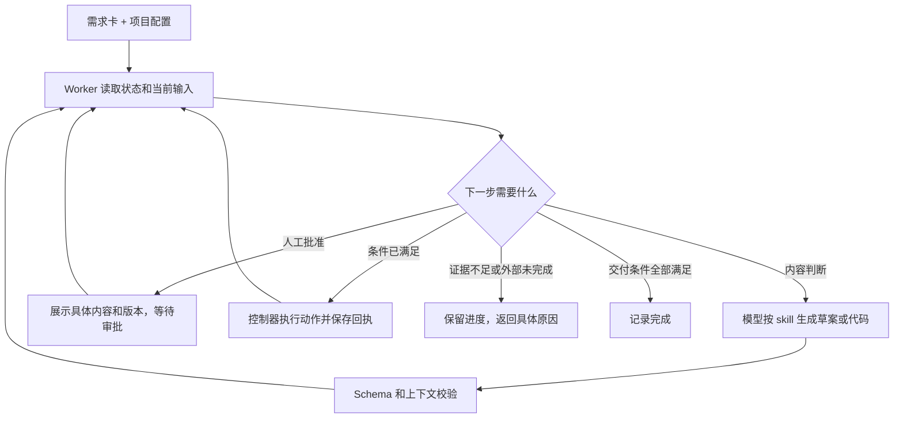

# Tom Autodev

**用脚本推进研发流程，用模型完成需要判断的工作，用人工审批控制关键动作。**

输入一张 iCafe 需求卡，Tom Autodev 组织需求澄清、设计、业务代码与独立产品测试、源码评审、iCode 提交、iPipe 验证和发布结果确认。每一步保存输入、产物和证据，便于中断后继续，也便于后续需求复用同一套规则。

一次需求运行称为一个 `run`；同一项目配置可以用于多个 run。

当前面向 **Comate + iCafe / iCode / iPipe / KU / 如流** 环境。Mac 负责读写源码、评审和流程控制；业务编译、模拟器和测试在配置好的 iPipe runner 执行。首次使用需要注册项目和配置平台访问。

[工作原理](#工作原理) · [首次使用](#首次使用) · [日常使用](#日常使用) · [停下来时怎么办](#停下来时怎么办) · [维护与验证](#维护与验证)

## 工作原理

### 谁负责什么

| 角色 | 负责的工作 | 交付物 |
|---|---|---|
| 人 | 确认需求、验收标准，审批设计、改动、提交及发布相关动作 | 绑定具体版本的决定和审批 |
| 模型 + skill | 澄清、设计、拆任务、写代码、评审、分析根因 | 当前阶段的结构化内容 `DraftContent` |
| Python 控制器 + worker | 决定下一步、校验输入输出、保存状态、执行已获批的平台操作 | 产物、审批记录、执行回执 |
| iPipe | 在指定环境编译、测试并提供发布相关证据 | 与代码版本、环境绑定的执行结果 |

`skill` 保存某一类工作的知识和产出要求。`worker` 是推进流程的 Python 代码：它读取当前状态，执行能确定完成的步骤；需要模型、人工决定或外部结果时，返回等待原因。



模型只交回内容。worker 负责封装产物身份、绑定审批、保存回执和推进阶段；模型无需重复拼装平台调用、状态迁移或恢复逻辑。详见 [Producer 合同](tom-autodev/references/producer-contract.md)。

### 一张需求卡如何走完

默认 `standard` 路径如下。Spec 是行为与验收约定；DAG 是带依赖关系的任务清单。

```text
确认需求卡与项目
  → 澄清验收标准
  → 一次生成 Spec + 任务 DAG
  → 为当前任务准备工作区
  → 计划 → 业务代码 + 产品测试 → 双轴 Review → 提交 iCode
  → 继续下一个就绪任务，直到全部任务完成提交
  → iPipe 验证所有必需模块 → 确认发布结果
```

Review 同时检查“是否满足代码/项目规则”和“是否实现批准的行为”。源码 Review 通过后才可申请提交审批；业务测试是否通过由 iPipe 的实际结果决定。

有确认的代码或测试问题时进入 Diagnose，再提出修复方向；环境、版本和流水线问题按各自类别处理。当前自动修复仍有接口限制，见[当前边界](#当前边界)。

### 为什么能够复用和恢复

- **规则有唯一来源。** [workflow_spec.py](tom-autodev/scripts/workflow_spec.py) 定义阶段、迁移、审批和运行模式；项目差异放在 profile，语言与领域知识放在 skill。
- **审批对应具体内容。** 待执行动作先算出输入指纹 `input_hash`；内容或版本变化后，旧审批不能继续使用。
- **恢复依据持久化记录。** 同一动作复用已保存的草案和已确认回执。外部结果不明时先核对结果，再决定是否重试。
- **输出可以检查。** Schema 校验字段，语义校验检查验收覆盖、版本和前驱绑定；固定场景用于观察不同模型的决策差异。

这能减少模型参与机械步骤，但不能保证不同模型生成的代码同样好。更换模型仍应运行 [skill 行为评测](evals/README.md)。

## 首次使用

### 1. 安装套件

下面所有命令均从**仓库根目录**执行。当前开发版本在 `phase1-workflowspec` 分支；已有仓库可直接使用当前检出目录。

```bash
# 首次获取
git clone --branch phase1-workflowspec https://github.com/zhaotao19860/tom-autodev-suite.git
cd tom-autodev-suite

# 确认 Python 环境包含 PyYAML
python3 -c 'import yaml; print(yaml.__version__)'

# 先查看安装计划，再创建 Comate skill 链接
python3 tom-autodev/scripts/install_links.py \
  --root "$PWD" --destination "$HOME/.comate/skills" --dry-run
python3 tom-autodev/scripts/install_links.py \
  --root "$PWD" --destination "$HOME/.comate/skills"
```

缺少 PyYAML 时，在所用 Python 环境安装 `PyYAML`。安装脚本遇到已有同名目录或不同链接会报告 `CONFLICT`，不会覆盖；链接安装后需保留源码目录。

套件包含 12 个 tom skill，运行时按阶段加载相关内容。NPL、Review 和 Diagnose 所需的参考能力已经内置，无需再安装 `npl-coder`、`code-review-qa` 或 `tom-autodebug`。独立远程排障模式还需要本机可用的 relay 和 tmux。

### 2. 注册一次项目

在 Comate 中调用 `/tom-autodev`，例如：

> 注册 BGW 项目。先核对业务仓、独立产品测试仓、iPipe 环境和审批渠道，列出缺失项；确认配置后保存项目 profile。

准备以下信息：

| 配置 | 需要说明 |
|---|---|
| 仓库 | 业务仓、iCode 模块、目标分支，以及独立产品测试仓 |
| 测试与环境 | 外部测试接口、夹具来源、稳定 iPipe 模板、允许参数、runner/工具/硬件要求 |
| 项目知识 | 语言 skill、项目 skill、可核对版本的源码和知识文档 |
| 协作与交付 | Review 方式、KU 位置、Comate/如流审批人和渠道、发布规则 |

配置保存在 `~/.tom-autodev/config/projects/<project>.yaml`。注册只保存和验证配置，不启动需求；后续新需求复用它。密钥使用既有认证渠道，不能写入项目 profile。详细字段见 [项目注册说明](tom-autodev/references/setup.md) 和 [profile schema](tom-autodev/schemas/project-profile.schema.json)。

### 3. 做只读预检

```bash
python3 tom-autodev/scripts/cli.py preflight bgw
```

预检核对配置和平台访问能力。若返回 `PROJECT_NOT_READY`，先补齐结果中列出的缺失项；不从目录名称猜测仓库、流水线或环境。

## 日常使用

### 开始一个新需求

在 Comate 中调用 `/tom-autodev`，给出明确项目和卡号：

> 使用 BGW 项目处理 iCafe 卡 BGW-1234。核对卡片和验收标准，按 standard 流程推进，在需要我决策或审批时给出具体内容。

上面的卡号是示例。没有验收标准时由 Grill 澄清；已有标准直接作为输入，不重新登记项目。

也可以通过 CLI 启动；它会通过 iCafe 客户端读取卡片快照：

```bash
# 替换为已确认的实际卡号；返回值中包含 run_id
python3 tom-autodev/scripts/cli.py start BGW-1234 bgw
```

**`start` 只创建本次运行，不会启动一个后台模型进程。** 后续由 Comate 中的 Agent 与 worker 协同：模型填写草案，worker 校验并推进；需要审批时，你在 Comate 或如流对展示的内容作出决定。

### 查询或继续已有需求

```bash
RUN_ID='替换为本次运行的 run_id'
python3 tom-autodev/scripts/cli.py status "$RUN_ID"
python3 tom-autodev/scripts/cli.py next "$RUN_ID"
python3 tom-autodev/scripts/cli.py resume "$RUN_ID"
```

- `status`：查看当前阶段和等待事项；加 `--json` 可看完整事件数据。
- `next`：查询下一步要求，不执行该动作。
- CLI `resume`：读取检查点和结果不明的外部操作，供恢复判断；实际继续由 worker 完成。

在 Comate 中可以直接说：

> 继续 run `<run_id>`。先核对已保存的草案、审批和实际工作区，只完成尚未完成的工作。

已配置 Stop hook 且 Comate 会话仍存活时，审批可触发续跑；会话结束后仍需要重新进入宿主。hook、worker API 和运维命令见 [操作参考](docs/OPERATIONS.md)。

### 选择流程复杂度

变更类别在启动时确定，并纳入 G0 的内容绑定。

| 类别 | 适用情况 | 与默认流程的差别 |
|---|---|---|
| `standard` | 常规需求，默认 | Spec 与 DAG 一次生成、一起审批 |
| `full` | 设计或依赖复杂，需要分开确认 | Spec 与 DAG 分别生成、分别审批 |
| `express` | 验收条件已明确的小修复 | 自动生成澄清结果，保留 Spec/DAG、计划和后续检查 |
| `hotfix` | 紧急修复 | 在 express 基础上免去计划自身的 G4；仍产计划，保留工作区 G4 |

G5 改动审批、G7 提交/初始流水线触发、G9 发布相关审批仍保留。审批次数由实际动作及模块决定；同一个 G7 标签不表示所有后续动作共享一笔审批。完整 gate 表见 [操作参考](docs/OPERATIONS.md#审批编号)。

## 停下来时怎么办

| 看到的状态或原因 | 含义与下一步 |
|---|---|
| `PRODUCER_WAIT` | 等模型草案。回到 Comate 处理该 job；不重复创建 run |
| `APPROVAL_WAIT` / `APPROVAL_REQUIRED` | 等具体内容获批。确认仓库、版本、动作和指纹后审批 |
| `REVIEW_INCOMPLETE` / `REVIEW_NEEDS_CLARIFICATION` | 补全审查范围，或请需求负责人回答明确的问题 |
| `PROJECT_NOT_READY` / `BASELINE_UNVERIFIED` | 补配置或匹配的基线证据，不跳过检查 |
| `WORKFLOW_SPEC_DRIFT` / `PROFILE_CONFLICT` | 运行中使用的规则或配置改变；核对版本，走相应恢复/重绑定流程 |
| `WORKER_LEASE_HELD` | 当前 run 已有 worker 驱动，避免并发启动第二个 |
| iPipe 未结束 / `RELEASE_WAITING` | 等平台结果或指定发布流程；轮询超时不等于业务测试失败 |
| 外部操作结果不明 | 先核对平台和回执，不能直接重发提交或重跑 |

### 当前边界

- 当前入口支持 Comate，生产运行依赖配置好的内网平台；仓库没有可直接启动的独立后台 LLM 服务。
- 每个任务绑定一个业务仓和一个独立产品测试仓。多业务仓需求需拆成可独立验证的兼容步骤；不可拆分的跨仓原子任务仍需扩展运行时。
- 发布阶段校验指定 build 的发布结果。worker 不会在 `RELEASE_WAITING` 时自行绕过平台发布流程。
- 当前诊断合同仍存在“修复前要求已有 diff 哈希”的冲突；单 run 的修复次数策略也尚未接入生产路由。详情与建议修复路径见 [整合报告](SKILL_CONSOLIDATION.md#交给控制器维护者的两个问题)。

## 目录与 skill 分工

```text
tom-autodev-suite/
├── README.md / CHANGELOG.md      # 使用入口与变更记录
├── docs/OPERATIONS.md            # worker 接入、审批、恢复与运维
├── evals/                       # 可重复的 skill 行为场景
├── tom-autodev/                  # 控制面、schema、平台 adapter
│   ├── SKILL.md
│   ├── scripts/                 # workflow_spec、worker、状态存储与测试
│   ├── schemas/
│   └── references/
└── tom-*/                       # 同级的阶段、语言和项目 skill
```

| 分工 | Skill |
|---|---|
| 流程入口、项目注册 | `tom-autodev` |
| 澄清、行为设计、任务拆解 | `tom-grill`、`tom-spec`、`tom-tasks` |
| 计划、实现、双轴评审 | `tom-plan`、`tom-implement`、`tom-review` |
| 失败诊断、独立远程排障 | `tom-diagnose` |
| 语言规则 | `tom-lang-c-cpp`、`tom-lang-npl` |
| 仓库、环境与项目合同 | `tom-project-bgw`、`tom-project-xflow` |

多个 skill 不意味着每个都要单独调用模型：standard 的 Spec/DAG 共用一轮，Review 两个轴也可在同一轮完成。保留职责边界能按需加载知识；合并和退役决定见 [整合报告](SKILL_CONSOLIDATION.md)。

## 维护与验证

从仓库根目录运行套件自身测试：

```bash
python3 -m unittest discover -s tom-autodev/scripts/tests -p 'test_*.py' -q
python3 -m unittest discover -s tom-review/tests -p 'test_*.py' -v
bash tom-diagnose/tests/test_autodebug.sh
git diff --check
```

这些测试使用临时仓库、隔离状态或模拟平台，不等于 BGW/XFlow 已通过真实业务测试。模型/提示词变更还需运行 [8 个行为场景](evals/README.md)，比较决定、输出合同与误报，而非文字相似度。

进一步阅读：[更新记录](CHANGELOG.md) · [操作参考](docs/OPERATIONS.md) · [Producer 合同](tom-autodev/references/producer-contract.md) · [skill 整合与遗留问题](SKILL_CONSOLIDATION.md)
