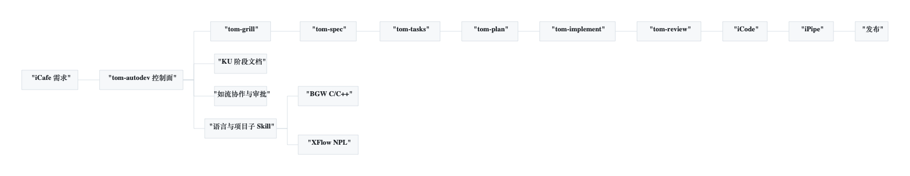
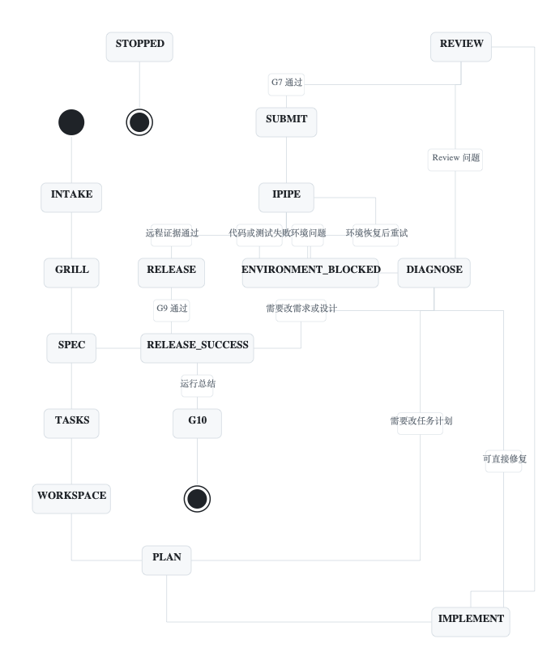
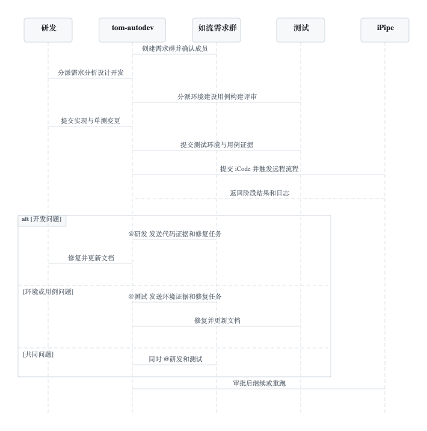

# tom-autodev 从需求到发布的可控自动研发

BGW 和 XFlow 原先各有一套研发 Skill。两套流程都能完成各自项目的工作，随着需求进入方式、文档管理、研发测试合作和流水线规则逐渐增多，重复维护开始带来实际成本。同一项能力需要写两遍，项目经验难以复用，故障处理也容易依赖个人记忆。

这次改造把公共流程收进 `tom-autodev`，把 C/C++、NPL、BGW、XFlow 的差异留在语言 Skill、项目 Skill 和知识图谱中。它作为 Comate 内的唯一入口，从 iCafe 读取需求，按 Spec 逐步生成任务、代码和测试代码，调用本地 Review，再将固定版本提交到 iCode。编译、单测、回归、集成和发布全部交给 iPipe。任何失败都要带着证据回到诊断和修复阶段，关键动作继续由研发、测试或负责人确认。



## 它解决了什么

### 一套流程适配不同项目

`tom-autodev` 只负责流程、状态、证据和外部系统调用。项目目录、代码约束、流水线、测试环境和知识来源由项目 profile 描述，语言规则由 `tom-lang-c-cpp` 或 `tom-lang-npl` 提供，项目知识由 `tom-project-bgw` 或 `tom-project-xflow` 提供。

新增项目时，公共流程无需复制。团队补齐 profile、项目 Skill、语言 Skill 和知识图谱，经过确认与预检后就能接入。`tom-autorelease` 已不再作为独立运行组件，其中有用的 iCode、iPipe、如流、重试和发布实现已经抽取到 `tom-autodev`。

### 每一步都有可核验的输入和输出

Grill、Spec、Tasks、Plan、Implement、Review、Diagnose 都产出带版本、内容哈希和来源关系的文档。文档发布到对应项目的 KU 目录，再把链接和哈希写回 iCafe 评论。需求正文保持为启动时的快照，后续判断能够追溯到当时批准的版本。

这种做法解决了常见的上下文漂移。代码 Review 对应哪个设计，测试用例来自哪条验收标准，iPipe 结果验证的是哪组代码版本，都能通过记录还原。

### 自动运行仍保留人的决定权

流程设置 G0 到 G10 的人工关口。项目与需求绑定、设计、任务拆分、单任务计划、候选代码、修复方案、iCode 提交、iPipe 重跑、发布和 Skill 自优化都需要相应审批。审批与输入哈希绑定，内容发生变化后旧审批自动失效。

Comate 和如流使用同一个审批编号。最先到达且有效的回复生效，后续回复只保留审计记录。这样能让流程持续运行，同时避免模型替人决定高风险动作。

### 本地与远程执行边界清楚

本机通常是 Mac，只承担代码和测试代码生成、源码 Review、工作区管理、控制面校验以及远程证据解析。BGW 和 XFlow 的编译、单测、回归、集成、模拟器、NCS、Docker 和发布命令均不得在本机执行。

iPipe 是项目运行证据的唯一来源。结果必须匹配固定的代码版本、流水线 profile 和环境指纹，否则流程停止，不会把不相关的成功记录当作本次需求的验证结果。

### 失败可以恢复，也不会重复产生副作用

每次外部操作都会先记录 intent，收到结果后再记录 receipt。程序在提交或触发后意外退出时，恢复逻辑先查询远端真实状态，再决定补写结果或继续等待，不会直接重复提交、重复建群或重复触发流水线。

同一故障签名连续两轮没有进展时，自动修复建议会停止。连续三次修复失败后强制进入架构评审。单个任务默认最多允许五轮修复。本次实现中 Task 5 经人工授权增加了一次 N7 例外修复，这类例外必须留下审批和原因。

## 运行原理

### 控制面驱动状态变化

主流程从 iCafe 需求开始，依次经过 Grill、Spec、任务 DAG、工作区确认、单任务计划、实现、Review、iCode、iPipe 和发布。控制面一次只推进当前 DAG 中可以执行的一个任务，前置证据不完整时保持原状态。



每个阶段遵守同一份 Phase Protocol。子 Skill 读取上一步的 ArtifactEnvelope，核对 `run_id`、`task_id`、输入哈希和代码版本，生成符合 Schema 的新文档，再交回控制面。子 Skill 不直接调用 iCafe、KU、如流、iCode 或 iPipe，所有外部操作集中由控制面完成。

### Spec 贯穿设计、编码和测试

Grill 负责找出含糊项、跨项目影响和待决策问题。Spec 把已经确认的需求写成可观察行为、测试接口、环境要求和追踪关系。Tasks 将 Spec 划成无环任务 DAG，每个任务都覆盖业务代码、测试代码与验收证据。Plan 再把当前任务落实到仓库、文件、符号、接口、测试用例和 iPipe 参数。

Implement 根据获批 Plan 同时生成业务变更和测试变更。Review 在固定基线上分别检查工程规范和 Spec 符合度。只有两条检查都通过，控制面才会申请 iCode 提交审批。

新需求对应的测试用例由 iCafe 需求、Grill 决策、Spec、Task Plan、项目代码和知识图谱共同生成。测试代码进入独立测试仓库，环境要求和用例集合写入阶段文档，最终由 iPipe 在稳定环境中执行。

### 研发和测试在同一个需求群里合作

G0 通过后，控制面按项目 profile 和 iCafe 字段解析成员，创建或复用如流需求群。研发负责需求分析、设计和开发，测试负责环境建设、用例构建和评审。iPipe 运行时两边共同关注阶段结果。



代码问题会携带日志、版本和诊断文档在群里提醒研发。环境或用例问题提醒测试。混合问题同时提醒双方。问题处理完成并经过相应审批后，控制面从已确认的检查点继续，不需要重新走一遍与故障无关的阶段。

### 故障带着证据返回设计或实现

Review 或 iPipe 失败后，控制面先冻结 Failure Evidence Bundle，其中包含代码版本、环境指纹、阶段、日志位置和失败分类。Diagnose 每轮只保留一个可证伪的原因假设，并给出最小验证方式。

确认属于代码或测试实现时，流程可以返回 Implement。任务计划有误时返回 Plan。需求行为或测试接口需要调整时返回 Spec。环境不满足时进入等待状态，由测试恢复环境，业务代码保持不变。所有修改都要更新 KU 文档，并使受影响的旧审批失效。

### 运行结束后可以改进 Skill

终态运行会生成脱敏的 RunSummary，汇总阶段耗时、审批、失败签名、修复次数和远程证据。系统可以据此提出只修改 `tom-autodev` 控制面文件的优化建议，写清原因、目标文件、收益、风险、回退方式和验证命令。

G10 审批通过后才能应用建议。业务仓库、项目 profile、iPipe 配置、发布规则、外部 Skill 和密钥不在自动修改范围内。验证失败时恢复原文件，并记录失败结果。

## 如何使用

### 接入项目前的准备

新项目或新语言第一次接入时，先通过 `tom-autodev` 的项目注册（setup）相位完成初始化（详见 `references/setup.md`）。它是一次性、人工监督的注册流程，不启动需求，不生成代码，不提交 iCode，也不触发 iPipe。

初始化需要收集并校验项目编号、业务仓库路径与 iCode 模块、目标分支和锁、独立测试仓库及 fixture 归属、语言与项目子 Skill、知识来源和图谱版本、测试接口、源码 Review 组件、稳定 iPipe 流水线、远程环境、Comate 与如流审批通道、发布规则和版本映射。初始化还会确认单测、回归、集成、NCS 或模拟器、发布阶段都在远程环境执行，本机没有替代路径。

初始化结果会把非敏感 profile 保存到 `~/.tom-autodev/config/projects/<project>.yaml`，记录内容哈希和人工确认凭据。只有返回 `READY` 的 profile 才能交给 `tom-autodev` 启动需求。覆盖已有 profile 时，除了人工确认，还要提供已保存的旧哈希。已有项目只需复用通过验证的 profile，不需要每次需求都重复初始化。

BGW 使用 `tom-lang-c-cpp` 和 `tom-project-bgw`。XFlow 使用 `tom-lang-npl` 和 `tom-project-xflow`。仓库路径、iCode 模块、目标分支、测试仓库、流水线编号和人员名单都要使用实际值，不能从当前目录猜测。

在 Comate 中调用初始化 Skill，完成 BGW 或 XFlow 注册后，再执行只读预检。

```bash
cd /Users/tom/Desktop/skills/tom-autodev-suite/tom-autodev
python3 scripts/cli.py preflight bgw
python3 scripts/cli.py preflight xflow
```

预检只查询 iCafe、KU、iCode、Review 组件、如流和 iPipe 的可用性，不创建需求群，不提交代码，也不触发流水线。缺少任何必需项时返回 `PROJECT_NOT_READY`。

### 启动一个需求

确认 iCafe 卡片和项目后启动运行。

```bash
python3 scripts/cli.py start ICAFECARD bgw
python3 scripts/cli.py status RUN_ID
python3 scripts/cli.py next RUN_ID
```

`start` 创建需求快照和运行记录。`status` 查看当前状态、阻塞原因和待审批项。`next` 返回下一步应执行的阶段及其输入，不会绕过证据和审批直接推进。

阶段 Skill 完成后，将 ArtifactEnvelope 作为 JSON 文件交回控制面。

```bash
python3 scripts/cli.py complete-phase RUN_ID /path/to/artifact-envelope.json
```

审批需要提交审批编号、决定、输入哈希、通道、运行编号和审批人。真实运行中通常由 Comate 或如流适配器完成，下面的命令用于操作和排障。

```bash
python3 scripts/cli.py approve APPROVAL_ID approve INPUT_HASH comate RUN_ID USERNAME
python3 scripts/cli.py resume RUN_ID
```

### 开发和流水线阶段怎样配合

研发在 Plan 获批后生成业务代码和单测代码，本地 Review 通过后提交完整候选 diff 给 G5。双轴 Review 通过并取得 G7 审批后，控制面把固定版本提交 iCode，并触发配置中允许的 iPipe 流水线。

iPipe 负责实际编译、单测、回归、集成和发布。失败后先看群内路由和 KU 诊断文档。开发问题由研发修复，环境与用例问题由测试处理。需要重跑失败阶段时使用 G8，正式发布前使用 G9。两次操作都必须绑定当前远程证据。

### 运行结束后的改进

发布成功或人工停止后，可以先生成运行总结，再创建优化建议。

```bash
python3 scripts/cli.py optimize RUN_ID build
python3 scripts/cli.py optimize RUN_ID propose --summary /path/to/run-summary.json
```

建议经过 G10 审批后才允许应用。应用前应核对目标文件和验证命令，应用后要检查归档结果。它只改控制面，不会改业务代码、项目 profile 或流水线模板。

## 当前完成度

截至 2026 年 8 月 11 日，控制面实现已经完成 Task 1 到 Task 10 的开发与三轮独立复审修复。最后一次验证结果如下。

| 验证项 | 结果 |
| --- | --- |
| Task 10 聚焦测试 | 32 项全部通过 |
| 控制面全量测试 | 437 项全部通过 |
| Schema 验证 | 14 项全部通过 |
| Python 编译检查 | 通过 |
| CLI 帮助检查 | 通过 |
| 安全扫描 | 通过 |

这些结果来自 fake transport、临时 SQLite、临时 Git 仓库和工作区，只证明控制面逻辑、适配器契约、恢复、审批和安全边界已经通过本地验证。它们不代表 BGW 或 XFlow 已经完成真实流水线验收。

当前还缺两个实际项目 profile。`~/.tom-autodev/config/projects/bgw.yaml` 和 `xflow.yaml` 尚不存在，因此两个项目的只读预检都会返回 `PROJECT_NOT_READY`，六个在线组件也没有被调用。下一步需要确认 profile、研发测试名单和非生产流水线，然后执行只读预检及 Task 11 非生产 iPipe 演练。

## 适合怎样的团队

这套方式适合需求、设计、开发、测试和发布需要多人参与，项目规则又存在明显差异的团队。它把模型擅长的分析、生成、检查和证据整理交给自动流程，把范围确认、技术取舍、提交、重跑、发布和自我修改保留给人。

团队第一次使用时，可以选择一个改动范围小、验收标准清楚、具备独立测试仓库和非生产流水线的需求。先完成 profile 和成员确认，再跑只读预检和非生产演练。真实证据稳定以后，再逐步扩大需求类型和项目范围。

## 参考资料

- 实施计划与 Task 10 复审报告保存在 `tom-autodev/docs/superpowers/plans` 和 `tom-autodev/.superpowers/sdd`，供维护者查阅
- [BGW 项目知识](https://ku.baidu-int.com/knowledge/HFVrC7hq1Q/9IaD11zSiz/sX0BTOBWJX/I15ClP2KW4ZGAK)
- [XFlow 项目知识](https://ku.baidu-int.com/knowledge/HFVrC7hq1Q/9IaD11zSiz/sX0BTOBWJX/meQ-Acjg0K09Xr)


